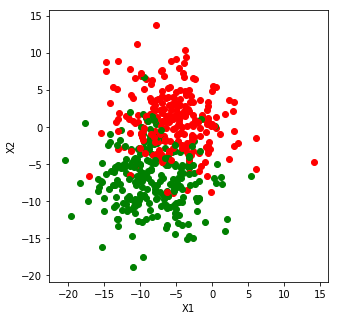
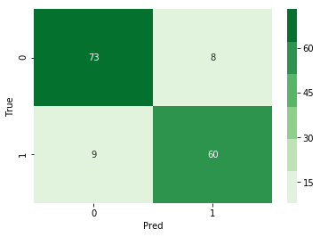

### Questions
* Evaluation Metrics - 
    * Always a good interview question to come up with scenarios where 
        * recall is a good metric or precision, etc
* Distance - 
    * Euclidian vs Minikowski vs Manhattan vs other metrics

### Objectives
YWBAT 
* code KNN from scratch - ???
* evaluate it using a confusion matrix
* apply evaluation metrics to a KNN model

### Outline


```python
import pandas as pd
import numpy as np

from sklearn.metrics import confusion_matrix, r2_score, recall_score, f1_score, precision_score, accuracy_score
from sklearn.neighbors import KNeighborsClassifier, NearestNeighbors
from sklearn.datasets import make_blobs
from sklearn.model_selection import train_test_split, cross_validate

import matplotlib.pyplot as plt
import seaborn as sns
```


```python
# Distance Metrics
def minkowski(v1, v2, p):
    total_distance = np.sum(np.abs(v1 - v2)**p)
    return total_distance**(1/p)
```


```python
v1 = np.array([0, 0])
v2 = np.array([3, 4])
v3 = np.array([2, 4.5])
```


```python
for p in np.linspace(1, 5, 9):
    print("p = {}".format(p))
    print("d1 = {}".format(minkowski(v1, v2, p))) # is one always smaller
    print("d2 = {}".format(minkowski(v1, v3, p)))
    print("-"*20)
```

    p = 1.0
    d1 = 7.0
    d2 = 6.5
    --------------------
    p = 1.5
    d1 = 5.584250376480029
    d2 = 5.349937402825397
    --------------------
    p = 2.0
    d1 = 5.0
    d2 = 4.924428900898052
    --------------------
    p = 2.5
    d1 = 4.688140842343588
    d2 = 4.728278858112068
    --------------------
    p = 3.0
    d1 = 4.497941445275415
    d2 = 4.628011187371595
    --------------------
    p = 3.5
    d1 = 4.372215289689355
    d2 = 4.573727528347276
    --------------------
    p = 4.0
    d1 = 4.284572294953817
    d2 = 4.5432677064496225
    --------------------
    p = 4.5
    d1 = 4.221163518110637
    d2 = 4.52575314162099
    --------------------
    p = 5.0
    d1 = 4.174027662897746
    d2 = 4.515500227570816
    --------------------


```python
data = make_blobs(n_samples=500, n_features=2, cluster_std=4.0, centers=2)
points, labels = data
```


```python
plt.figure(figsize=(5, 5))
color_dict = {0: 'r', 1: 'g'}
for p, l in zip(points, labels):
    plt.scatter(p[0], p[1], c=color_dict[l])
plt.xlabel("X1")
plt.ylabel("X2")
plt.show()
```





```python
xtrain, xtest, ytrain, ytest = train_test_split(points, labels, train_size=0.70)
```

    /anaconda3/lib/python3.7/site-packages/sklearn/model_selection/_split.py:2179: FutureWarning: From version 0.21, test_size will always complement train_size unless both are specified.
      FutureWarning)


```python
for p in np.linspace(1, 5, 9):
    for n in [3, 4, 5]:
        print("p = {}, n = {}".format(p, n))
        knn = KNeighborsClassifier(n_neighbors=n, p=p)
        knn.fit(xtrain, ytrain)
        print(knn.score(xtest, ytest)) # accuracy score
        print("-"*50)
```

    p = 1.0, n = 3
    0.8333333333333334
    --------------------------------------------------
    p = 1.0, n = 4
    0.8466666666666667
    --------------------------------------------------
    p = 1.0, n = 5
    0.8666666666666667
    --------------------------------------------------
    p = 1.5, n = 3
    0.8533333333333334
    --------------------------------------------------
    p = 1.5, n = 4
    0.8466666666666667
    --------------------------------------------------
    p = 1.5, n = 5
    0.86
    --------------------------------------------------
    p = 2.0, n = 3
    0.86
    --------------------------------------------------
    p = 2.0, n = 4
    0.8466666666666667
    --------------------------------------------------
    p = 2.0, n = 5
    0.86
    --------------------------------------------------
    p = 2.5, n = 3
    0.8733333333333333
    --------------------------------------------------
    p = 2.5, n = 4
    0.8533333333333334
    --------------------------------------------------
    p = 2.5, n = 5
    0.8666666666666667
    --------------------------------------------------
    p = 3.0, n = 3
    0.8733333333333333
    --------------------------------------------------
    p = 3.0, n = 4
    0.8533333333333334
    --------------------------------------------------
    p = 3.0, n = 5
    0.8666666666666667
    --------------------------------------------------
    p = 3.5, n = 3
    0.8666666666666667
    --------------------------------------------------
    p = 3.5, n = 4
    0.86
    --------------------------------------------------
    p = 3.5, n = 5
    0.8666666666666667
    --------------------------------------------------
    p = 4.0, n = 3
    0.8733333333333333
    --------------------------------------------------
    p = 4.0, n = 4
    0.86
    --------------------------------------------------
    p = 4.0, n = 5
    0.8666666666666667
    --------------------------------------------------
    p = 4.5, n = 3
    0.88
    --------------------------------------------------
    p = 4.5, n = 4
    0.86
    --------------------------------------------------
    p = 4.5, n = 5
    0.88
    --------------------------------------------------
    p = 5.0, n = 3
    0.8733333333333333
    --------------------------------------------------
    p = 5.0, n = 4
    0.86
    --------------------------------------------------
    p = 5.0, n = 5
    0.8866666666666667
    --------------------------------------------------


```python
knn = KNeighborsClassifier(n_neighbors=5, p=5)
knn.fit(xtrain, ytrain)
```


    KNeighborsClassifier(algorithm='auto', leaf_size=30, metric='minkowski',
               metric_params=None, n_jobs=None, n_neighbors=5, p=5,
               weights='uniform')


```python
# how do we evaluate?
```


```python
# evaluation metrics
```


```python
# plot a confusion matrix
y_pred = knn.predict(xtest)
cm = confusion_matrix(ytest, y_pred)
```


```python
sns.heatmap(cm, annot=True, cmap=sns.color_palette('Greens'))
plt.xlabel("Pred")
plt.ylabel("True")
plt.show()
```





```python
# example of minimizing false negatives

# ad serving, predicting if an ad will get clicked.  
# 0s - 5M+ 
# 10k - 1s

# 1/500
# if I'm using accuracy then I would make a model that always predicts 0
# accuracy = 0.99995

# in this case use recall, because recall minimizes your FN rate
# recall -> "better safe than sorry"
# recall -> "cancer test for first/second screening"


# precision -> "predicting if a baby is going to have some condition"
# precision -> "if someone needs chemo"
```


```python
cross_validate() # this tool contains a 'scoring' parameter where you can feed recall/f1/precision/accuracy
```


```python

```


```python

```

### Assessment/What did we learn?
* 100% accuracy isn't a great predictor
* Using different metrics of distance leads to different neighborhoods
* Reasons to favor recall over precision and vice versa
* Confusion Matrix is a great evaluation tool
* sklearn has a KNN tool
